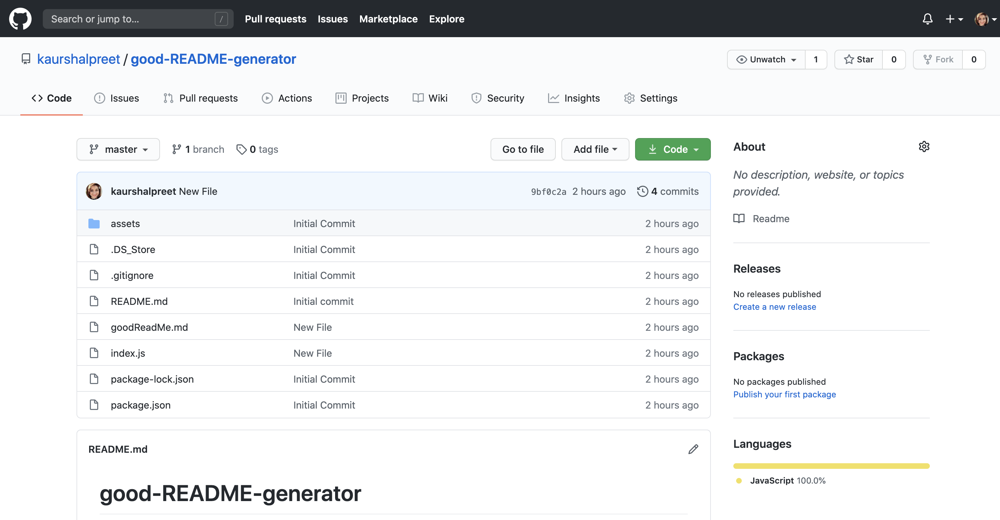

# good-README-generator

  

  ## Description
  This is a command-line application that will allow a quick and easy generation of a project README to get started quickly. 
  This will allow a project creator to spend more time working on finishing the project and less time creating a good README. 
  This application dynamically generates a professional README.md from a user's input using the Inquirer package. The application will be invoked with the following command: node index.js  
  You can also find a walkthrough video that demonstrates the functionality of the application [here](https://drive.google.com/file/d/1TXyizn7U8UYdwsFN-C9R23ucC8Tcek_M/view?usp=sharing)

  [The Link to My Github Repository](https://github.com/kaurshalpreet/good-README-generator)

   

---

  ## Table of Contents
  1. [Installation](#Installation)
  1. [Usage](#Usage)
  1. [Credits](#Credits)
  1. [License](#License)
---

  ## Installation
 
  npm init  
  npm install inquirer   

---

  ## Usage

  You need to open index.js in integrated terminal and type "node index.js" and prompts to enter your content will appear. 
  You can simply enter your text in MarkDown format.  

  WHEN I am prompted for information about my application repository  
  THEN a quality, professional README.md is generated with the title of your project and sections entitled Description, Table of Contents, Installation, Usage, License, Contributing, Tests, and Questions  
  WHEN I enter my project title  
  THEN this is displayed as the title of the README  
  WHEN I enter a description, installation instructions, usage information, contribution guidelines, and test instructions  
  THEN this information is added to the sections of the README entitled Description, Installation, Usage, Contributing, and Tests  
WHEN I choose a license for my application from a list of options  
THEN a badge for that license is added hear the top of the README and a notice is added to the section of the README entitled License that explains which license the application is covered under  
WHEN I enter my GitHub username  
THEN this is added to the section of the README entitled Questions, with a link to my GitHub profile  
WHEN I enter my email address  
THEN this is added to the section of the README entitled Questions, with instructions on how to reach me with additional questions  
WHEN I click on the links in the Table of Contents  
THEN I am taken to the corresponding section of the README  

---

## Credits

* UC Davis BootCamp - Instructors and TAs
* https://www.w3schools.com/
* https://www.youtube.com/
* https://www.google.com/
* https://www.npmjs.com/package/inquirer
* https://choosealicense.com/licenses/
* https://shields.io/category/license

---

  ## License
  #### This application is licensed under the [MIT License](https://opensource.org/licenses/MIT)
  
---

  ## Collaborators
  If you want to contribute or collaborate for the project, you can simply enter your input [here](https://github.com/kaurshalpreet/good-README-generator/issues)

  
---

  ## Test
  There is no specific test for this application. Please test as per your needs and provide feedback.

---

  ## Questions
  #### You can reach me via my [Github](https://github.com/kaurshalpreet) account. 
  #### Email me with any additional questions at: kaurshalpreet@gmail.com  
 
---