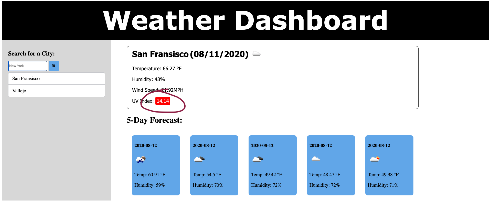

  # Weather Dashboard
---

  

  ## Description
  This project is a weather dashboard application that will display the temperature, wind speed, humidity and UV Index of any city that you will enter in the search box. This app will run in the browser and feature dynamically updated HTML and CSS powered by a JavaScript code. The application will also display the weather forecast for next 5 days. The application will also save the search history and you can simply click on the last searched city to check it's current weather. This was something very new and a toughest one for me and I have put so much effort in learning, understanding and executing the concepts of javascript, API and API Keys. I have used the [OpenWeather API](https://openweathermap.org/api) to retrieve weather data for cities.

 [The project can be accessed at my github repository](https://github.com/kaurshalpreet/homework6-Weather-Dashboard)

 

  [The Link to My Github Repository](https://github.com/kaurshalpreet/homework6-Weather-Dashboard))
---

  ## Table of Contents
  1. Installation
  1. Usage
  1. Credits
  1. License
---

  ## Installation
  Steps
1. This Project is a weather information app that will help you plan your trips accordingly.
 2. You will be able to check the temperature, wind speed, humidity and UV index for a city. You will 
3. also be able to search your last searched city to the local storage and simply clicking on 
4. it will display it's current weather and other information.

---

  ## Usage
  When you open the page, you will get a search input box to put the name of the city and click on the search icon. when you click on it, it will display the current and future conditions for that city and that city is added to the search history.

---

When you view current weather conditions for that city, You will be able to see the city name, the date, an icon representation of weather conditions, the temperature, the humidity, the wind speed, and the UV index. You will also see the future weather condition for that day that will display the data for next 5 days, the date, an icon representation of weather conditions, the temperature, and the humidity.

---

When you are viewing the UV index, you will see a color that indicates whether the conditions are favorable(green), moderate(yellow), not favorable(orange) or severe(red).

---

When you click on a city in the search history, then you are again presented with current and future conditions for that city.

---

When you open or reload the weather dashboard, then you are presented with the last searched city forecast.

---

  ## Credits
  * UC Davis BootCamp-Instructor & TAs!
* https://www.w3schools.com/
* https://www.google.com/
* https://www.youtube.com/
* https://openweathermap.org/api
* https://momentjs.com

---

  ## License
  #### This application is licensed under the [Apache License 2.0](https://www.apache.org/licenses/LICENSE-2.0)
  
---

  ## Collaborators
  Please connect with me via Github

  #### You can reach me via my Github account at [Github](https://github.com/kaurshalpreet)
  
---

  ## Test
  There are no specific tests for this application. Please test as per your needs and provide feedback

---

 
